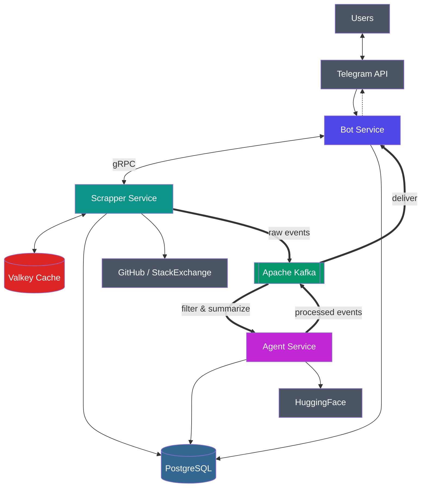

# LinkTracker

Сервис для отслеживания изменений на GitHub и StackOverflow с AI-фильтрацией и суммаризацией уведомлений.

Проект состоит из трёх микросервисов, общающихся через **gRPC** и **Kafka**(event-driven). Использует **PostgreSQL**, **Kafka**, **Valkey**, **Prometheus**, **Grafana**.

- [Технологии](#технологии)
- [Модели данных](#модели-данных)
- [Архитектура](#архитектура)
- [Проблемы и их решения](#проблемы-и-их-решения)
- [Тестирование](#тестирование)
- [Мониторинг](#мониторинг)
- [Запуск](#запуск)

## Технологии

- **Go 1.26+**
- [gRPC](https://github.com/grpc/grpc-go)
- [Kafka](https://github.com/segmentio/kafka-go)
- [Valkey](https://github.com/valkey-io/valkey-go)
- [PostgreSQL(pgx)](https://github.com/jackc/pgx)
- [Schema Registry(Avro)](https://github.com/riferrei/srclient)
- [Uber FX](https://github.com/uber-go/fx)
- [Scheduler](https://github.com/go-co-op/gocron)
- [Circuit Breaker](https://github.com/sony/gobreaker)
- [Testcontainers](https://github.com/testcontainers/testcontainers-go)
- [Prometheus](https://github.com/prometheus/client_golang)
- [Grafana](https://github.com/grafana/grafana)
- [grafana/K6](https://github.com/grafana/k6)
- Docker / Docker Compose

## Модели данных

### PostgreSQL


### Apache Kafka

| Топик | Назначение | Формат |
| ------- | ------------ | -------- |
| `link-raw-updates` | Сырые события от Scrapper к Agent | [Avro](/deploy/schema/0002_raw_update.json) |
| `link-raw-updates-dlq` | Dead letter для необработанных событий | Avro |
| `link-processed-updates` | Обработанные события от Agent к Bot | [Avro](/deploy/schema/0003_prepared_update.json) |
| `link-processed-updates-dlq` | Dead letter для обработанных событий | Avro |

## Архитектура



· [Extended diagram](docs/eda_extended.md) · [Data Flow](docs/data_flow.md) · [Подробнее про структуру](docs/file_structure.md) ·

## Проблемы и их решения

Проект решает не только задачу отслеживания изменений, но и некоторые проблемы распределённых систем:  доставку событий, устойчивость к сбоям, работу под нагрузкой, идемпотентную обработку и наблюдаемость.

### Надёжная доставка событий

**Проблема:** при прямой отправке событий возможна их потеря между записью в БД и публикацией в брокер.

**Решение:** `Transactional Outbox` - сначала изменение состояния и событие сохраняются в одной транзакции, затем отдельный relay job публикует событие в Kafka и помечает его, это исключит потерю событий при сбоях.

### Идемпотентная обработка

**Проблема:** в распределённой системе повторная доставка может привести повторной обработки одного и того же события.

**Решение:** `Inbox/Outbox`, `idempotency-key`, `unique constraints` - consumer сначала фиксирует событие в БД, затем relay job переводит его в следующий этап, это позволит правильно обрабатывать рестарты и повторную доставку сообщений.

### Работа под нагрузкой

**Проблема:** crawl внешних ресурсов и обработка событий - io bound задачи, последовательная обработка может увеличить latency запросов.

**Решение:** в Scrapper и Agent используются `worker pool`, пакетная обработка и асинхронная доставка через Kafka. Для получения данных из БД используется `cursor-based pagination` вместо `OFFSET & LIMIT`, чтобы избежать деградации на больших объёмах и проблем с памятью.

### Устойчивость к сбоям зависимостей

**Проблема:** Telegram API, GitHub/StackExchange API и HuggingFace могут временно отвечать с ошибками или деградировать в плане latency ответа.

**Решение:** вызовы зависимостей использую: `retry exponential backoff + jitter`, `circuit breaker`, это защитит систему от каскадного отказа, бесконечных повторов при длительной недоступности.

### Асинхронное взаимодействие между сервисами

**Проблема:** синхронная связь между сервисами связыжет время ответа одного компонента со скоростью другого.

**Решение:** для межсервисного обмена событиями используется Kafka, синхронный gRPC используестя для командного взаимодействия Bot <-> Scrapper, где нужен ответ пользователю в реальном времени, для этапов с потенциально большой нагрузкой используется событийная модель, но стоит понимать что теперь система перешла от `strong consistency` к `eventual consistency`.

### Наблюдаемость и эксплуатация

**Проблема:** в системе без метрик и правильного логирования трудно понять, где возникла деградация: в БД, брокере, внешнем api или бизнес логике.

**Решение:** реализованы метрики через Prometheus Pushgateway, дашборды в Grafana, алерты по ресурсам и структурированные логи через `slog`(вообще стоит добавить Loki для трейсинга удобного и анализа). Метрики разделены на RED и business: latency, rate, errors, количество подписок, количество команд, число уведомлений, используемая память и горутины.

## Тестирование

### Unit и интеграционные тесты

Table-driven тесты для domain и application слоёв, используются `testify`, `testing`, `uber-go/mock`.

Для тестирования внешних зависимостей используется `testcontainers-go`: поднимаются PostgreSQL, Kafka и Valkey в контейнерах.

```bash
make test        # unit
make test-slow   # интеграционные
make test-all    # unit и интеграционные
make html_test   # html отчет
```

### Нагрузочное тестирование

Тестирование через grafana/k6 для gRPC|HTTP с использованием Valkey и без него. Сравнение перцентилей, RPS, fail rate и общие результаты

· [Load testing](/docs/load_testing.md) ·

## Мониторинг

- **Pushgateway** - каждый сервис пушит метрики каждые 10с
- **Prometheus** - скраппит Pushgateway
- **Grafana** - RED Dashboard (latency, rate, errors, memory), Business Dashboard (подписки, команды, уведомления)
- **Alert** - RAM > 200MB for 1 min


· [Observability](docs/observability.md) ·

## Запуск

```bash
cd deploy
cp .env.example .env                      # заполнить .env токенами(gh, tg, hf)
cp valkey.example.conf valkey.conf        
cp sentinel.example.conf sentinel.conf    # заполнить <username>/<password>
cp users.example.acl users.acl            # заполнить <username>/<password>

docker compose up -d --build
```

· [Guide](docs/guide.md) ·
