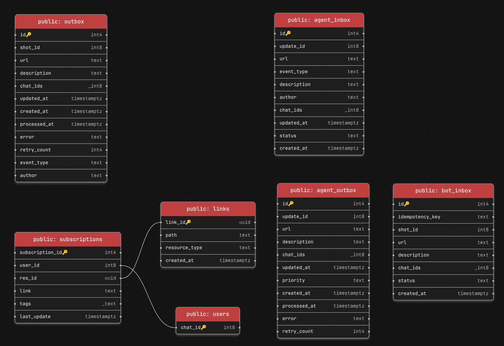
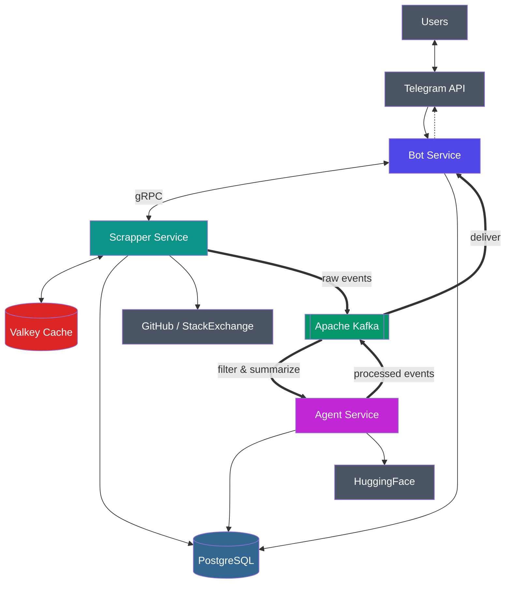

# LinkTracker

[](https://codespaces.new/n1jke/link-tracker)

A service for tracking changes on **GitHub** and **StackOverflow** with AI filtering and notification summarization delivered via Telegram.

The project consists of three microservices communicating via **gRPC** and **Kafka** (event-driven). Uses **PostgreSQL**, **Kafka**, **Valkey**, **Prometheus**, **Grafana**.

---

- [Target Audience and Needs](#target-audience-and-needs)
- [Functional Boundaries](#functional-boundaries)
- [Demo](#demo)
- [Technologies](#technologies)
- [Data Models](#data-models)
- [Architecture](#architecture)
- [Problems and Solutions](#problems-and-solutions)
- [Testing](#testing)
- [Monitoring](#monitoring)
- [Running Locally](#running-locally)
- [Running in Codespaces](#running-in-codespaces)
- [Deployed Version](#deployed-version)

---

## Target Audience and Needs

| Segment | Share | Needs |
| --- | --- | --- |
| Individual developers | 60% | Track specific GitHub repos and StackOverflow tags relevant to their tech stack |
| Tech teams | 30% | Share a Telegram chat to collectively monitor project dependencies and receive AI-summarized updates |
| Open-source maintainers | 10% | Monitor activity across their projects (issues, PRs, releases) with noise filtering |

**Core needs:**

- Real-time notifications about GitHub events (issues, PRs, releases) and StackOverflow activity (questions, answers)
- AI-powered filtering to reduce noise - only relevant changes get summarized
- Simple setup: add a link, get updates

## Functional Boundaries

### Covered by MVP

- Track GitHub repositories (issues, pull requests, releases)
- Track StackOverflow pages (new questions, answers)
- AI-based event filtering (stop words, excluded authors, priority keywords)
- AI summarization for long content (HuggingFace Inference API)
- Grouped notifications delivered to Telegram
- Basic monitoring (Prometheus + Grafana: RED and Business dashboards)

### Not Covered (MVP)

- Custom per-user notification schedules or digests
- Multi-channel delivery (email, Slack, Discord, etc.)
- Historical analytics or trends dashboard for end users
- User accounts - all users share the same Telegram chat context

## Demo

[Video demo](https://www.youtube.com/watch?v=ZnGeO3fNaOQ) — walkthrough of the project.

**Note:** Project not be deployed to a publicly accessible server. I try with GitHub Codespaces and some other providers but met problems with docker deploy (locally all work correct and it also easy to start with [guide](/docs/guide.md)). The video demo above demonstrates the complete functionality.

## Technologies

- **Go 1.26+**
- [gRPC](https://github.com/grpc/grpc-go)
- [Kafka](https://github.com/segmentio/kafka-go)
- [Valkey](https://github.com/valkey-io/valkey-go)
- [PostgreSQL (pgx)](https://github.com/jackc/pgx)
- [Schema Registry (Avro)](https://github.com/riferrei/srclient)
- [Uber FX](https://github.com/uber-go/fx)
- [Scheduler](https://github.com/go-co-op/gocron)
- [Circuit Breaker](https://github.com/sony/gobreaker)
- [Testcontainers](https://github.com/testcontainers/testcontainers-go)
- [Prometheus](https://github.com/prometheus/client_golang)
- [Grafana](https://github.com/grafana/grafana)
- [K6](https://github.com/grafana/k6)
- Docker / Docker Compose

## Data Models

### PostgreSQL



### Apache Kafka

| Topic | Purpose | Format |
| --- | --- | --- |
| `link-raw-updates` | Raw events from Scrapper to Agent | [Avro](/deploy/schema/0002_raw_update.json) |
| `link-raw-updates-dlq` | Dead letter queue for unprocessed raw events | Avro |
| `link-processed-updates` | Processed events from Agent to Bot | [Avro](/deploy/schema/0003_prepared_update.json) |
| `link-processed-updates-dlq` | Dead letter queue for failed processed events | Avro |

## Architecture



- [Extended EDA diagram](docs/eda_extended.md)
- [Data Flow](docs/data_flow.md)
- [File structure](docs/file_structure.md)

## Problems and Solutions

The project addresses not only the core tracking problem but also common distributed system challenges: reliable event delivery, fault tolerance, load handling, idempotent processing, and observability.

### Reliable Event Delivery

**Problem:** Direct event publishing risks losing events between database write and broker publication.

**Solution:** `Transactional Outbox` - state changes and events are persisted in a single DB transaction. A separate relay job publishes events to Kafka and marks them as sent, eliminating event loss on crashes.

### Idempotent Processing

**Problem:** In a distributed system, redelivery can lead to duplicate processing of the same event.

**Solution:** `Inbox/Outbox` pattern with `idempotency-key` and `unique constraints` - the consumer first records the event in the database, then a relay job advances it to the next stage. This correctly handles restarts and message redelivery.

### Load Handling

**Problem:** Crawling external resources and event processing are I/O-bound tasks. Sequential processing increases latency.

**Solution:** Scrapper and Agent use `worker pools`, batch processing, and async delivery via Kafka. Database reads use `cursor-based pagination` instead of `OFFSET & LIMIT` to avoid degradation on large datasets.

### Dependency Fault Tolerance

**Problem:** Telegram API, GitHub/StackExchange API, and HuggingFace can return errors or degrade in latency.

**Solution:** External calls use `retry with exponential backoff + jitter` and `circuit breaker`, protecting the system from cascading failures and infinite retries during prolonged outages.

### Async Service Interaction

**Problem:** Synchronous coupling ties one service's response time to another's processing speed.

**Solution:** Event exchange between services uses Kafka for async communication. Synchronous gRPC is used only for command interactions (Bot ↔ Scrapper) where real-time user response is needed. The trade-off is a shift from `strong consistency` to `eventual consistency`.

### Observability

**Problem:** Without metrics and structured logging, it is difficult to locate degradation - whether in the database, broker, external API, or business logic.

**Solution:** Metrics are pushed via Prometheus Pushgateway, visualized in Grafana dashboards, with resource alerts and structured logging via `slog`. Metrics follow RED and business categories: latency, rate, errors, subscriptions, commands, notifications, memory, and goroutines.

## Testing

### Unit & Integration Tests

Table-driven tests for domain and application layers using `testify`, `testing`, `uber-go/mock`.

External dependencies are tested via `testcontainers-go`: PostgreSQL, Kafka, and Valkey are spun up in containers.

```bash
make test        # unit tests
make test-slow   # integration tests
make test-all    # unit + integration
make html_test   # HTML coverage report
```

### Load Testing

Load testing via K6 for gRPC and HTTP endpoints with and without Valkey. Comparison of percentiles, RPS, failure rate, and general results.

- [Load testing report](/docs/load_testing.md)

## Monitoring

- **Pushgateway** - each service pushes metrics every 10 seconds
- **Prometheus** - scrapes Pushgateway
- **Grafana** - RED Dashboard (latency, rate, errors, memory), Business Dashboard (subscriptions, commands, notifications)
- **Alert** - RAM > 200 MB for 1 minute


- [Observability details](docs/observability.md)

## Running Locally

```bash
cd deploy
cp .env.example .env                       # fill in tokens (GitHub, Telegram, HuggingFace)
cp valkey.example.conf valkey.conf
cp sentinel.example.conf sentinel.conf     # set <username>/<password>
cp users.example.acl users.acl             # set <username>/<password>

docker compose up -d --build
```

- [Setup guide](docs/guide.md)

## Running in Codespaces

[](https://codespaces.new/n1jke/link-tracker)

1. Click the badge above to open the repo in GitHub Codespaces
2. Wait for the container to initialize (Docker-in-Docker, Go toolchain)
3. In the terminal:

```bash
   cd deploy
   cp .env.example .env
   cp valkey.example.conf valkey.conf
   cp sentinel.example.conf sentinel.conf
   cp users.example.acl users.acl
   # Edit .env with your tokens (GitHub, Telegram, HuggingFace)
   docker compose up -d --build
```

4. Accessible services:
   - Grafana: `http://localhost:3000`
   - Kafka UI: `http://localhost:8085`
   - Telegram bot will be available via its public @username (configured in BotFather)

## Deployed Version

**Telegram bot:** [t.me/web_crawler_notifier_bot](t.me/web_crawler_notifier_bot)

The project is deployed in GitHub Codespaces with Docker Compose. All three microservices (Scrapper, Agent, Bot) plus supporting infrastructure (PostgreSQL, Kafka, Valkey, Prometheus, Grafana) run inside the codespace environment.

---

## Project Structure

```md
cmd/                    # Entry points (bot, scrapper, agent, report)
internal/               # Application logic
  bot/                  # Bot service (Telegram + gRPC client + Kafka consumer)
  scrapper/             # Scrapper service (crawler + gRPC server + Kafka producer)
  agent/                # Agent service (Kafka consumer/producer + AI)
  infrastructure/       # Shared infra (repository, transport, grpc, http)
  tests/                # Integration tests (testcontainers)
api/                    # API definitions (gRPC proto, OpenAPI specs)
deploy/                 # Docker Compose, Dockerfiles, configs
migrations/             # PostgreSQL migrations
config/                 # Configuration structs & mappers
pkg/                    # Shared packages (retry, Avro helpers)
docs/                   # Documentation & images
load_testing/           # K6 scripts
```

---

## License

MIT License. See [LICENSE](LICENSE) for details.
