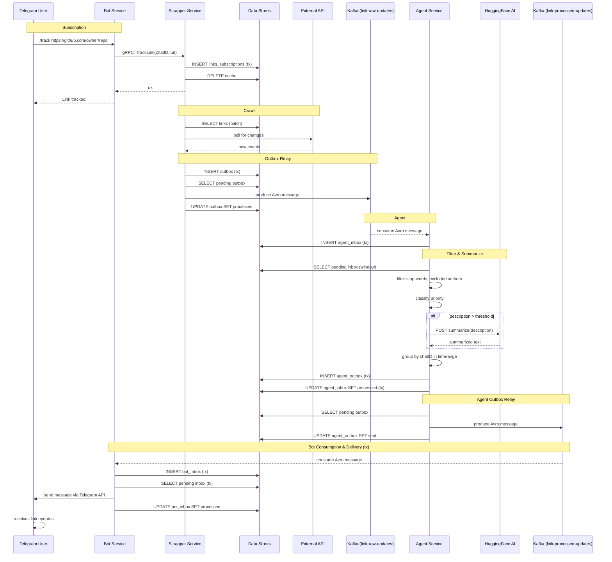

# Data Flow — Event Lifecycle

## Fault tolerance

- **Transactional Outbox/Inbox** Все события сохраняются/обновляются в рамках транзакции БД, и только потом обрабатываются  фоновой job для отправки/обработки события
- **Idempotency:** Каждое событие включает `idempotency-key` header, consumers обеспечивает идемпотентную обработку через unique constraints
- **DLQ:** Необработанные события после допустимого лимита попадают в dead-letter topics для ручного разбора
- **Circuit Breaker + Retry:** gRPC/HTTP вызовы используют exponential backoff и circuit breaker
- **Rate Limiter** gRPC/HTTP запросы к scrapper сервису использую rate-limitting interceptors/middleware
