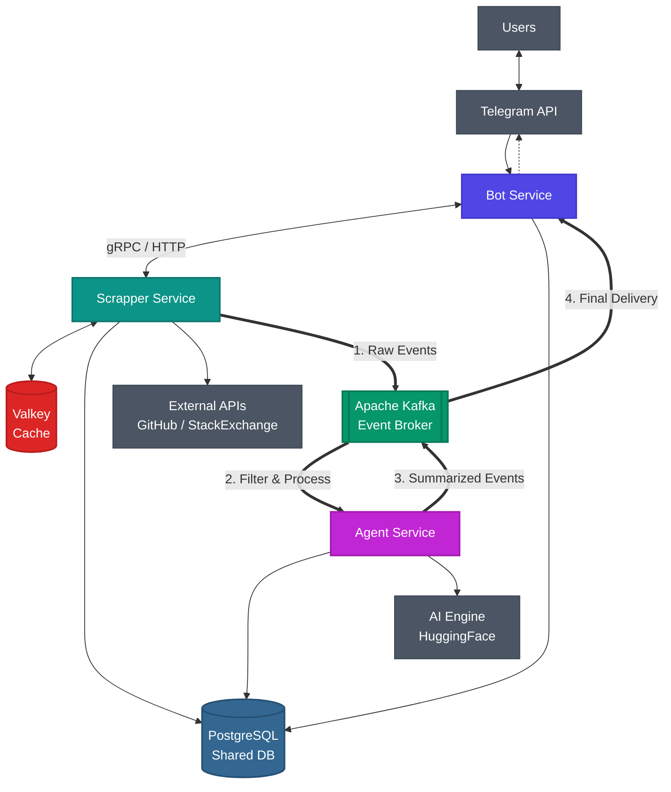

# Abstract EDA diagram

```mermaid
graph TD
    %% External Elements
    User[Users] <--> TG[Telegram API]
    ExtAPI[External APIs\nGitHub / StackExchange]
    AI[AI Engine\nHuggingFace]

    %% Separated Microservices (Distinct Colors)
    Bot[Bot Service]
    Scrapper[Scrapper Service]
    Agent[Agent Service]

    %% Databases & Broker (Specific Colors)
    PG[(PostgreSQL\nShared DB)]
    VK[(Valkey\nCache)]
    Kafka[[Apache Kafka\nEvent Broker]]

    %% Synchronous & Cache Flow
    TG --> Bot
    Bot <-->|gRPC / HTTP| Scrapper
    Scrapper <--> VK

    %% Database Connections
    Scrapper ---> PG
    Agent ---> PG
    Bot ---> PG

    %% Async Event Pipeline
    Scrapper --> ExtAPI
    Scrapper == "1. Raw Events" ==> Kafka
    Kafka == "2. Filter & Process" ==> Agent
    Agent --> AI
    Agent == "3. Summarized Events" ==> Kafka
    Kafka == "4. Final Delivery" ==> Bot
    Bot -.-> TG

    %% --- Color Styling ---
    classDef bot fill:#4f46e5,stroke:#4338ca,stroke-width:2px,color:#fff;
    classDef scrapper fill:#0d9488,stroke:#0f766e,stroke-width:2px,color:#fff;
    classDef agent fill:#c026d3,stroke:#a21caf,stroke-width:2px,color:#fff;
    
    classDef postgres fill:#336791,stroke:#264f73,stroke-width:2px,color:#fff;
    classDef valkey fill:#dc2626,stroke:#b91c1c,stroke-width:2px,color:#fff;
    classDef broker fill:#059669,stroke:#047857,stroke-width:2px,color:#fff;
    classDef external fill:#4b5563,stroke:#374151,stroke-width:1px,color:#fff;

    class Bot bot;
    class Scrapper scrapper;
    class Agent agent;
    class PG postgres;
    class VK valkey;
    class Kafka broker;
    class User,TG,ExtAPI,AI external;
```
