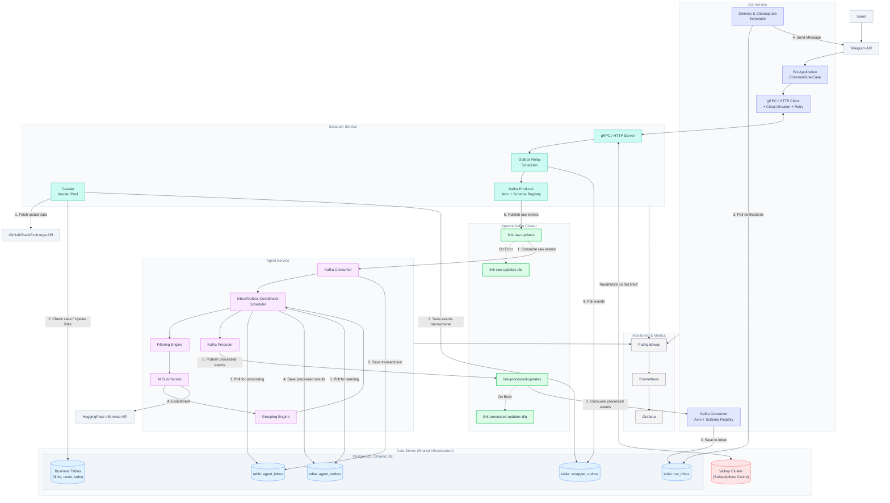

# Extended EDA diagram

```mermaid
graph TD
    %% Users & External Integration
    U1[Users] --> TG[Telegram API]
    Links[GitHub/StackExchange API]
    HF[HuggingFace Inference API]

    %% Bot Service Internals
    subgraph Bot["Bot Service"]
        BotApp[Bot Application\nCommandUseCase]
        BotGRPC[gRPC / HTTP Client\n+ Circuit Breaker + Retry]
        BotKafka[Kafka Consumer\nAvro + Schema Registry]
        BotSched[Delivery & Cleanup Job\nScheduler]

        BotApp --> BotGRPC
    end

    %% Scrapper Service Internals
    subgraph Scrapper["Scrapper Service"]
        ScGRPC[gRPC / HTTP Server]
        ScCrawler[Crawler\nWorker Pool]
        ScSched[Outbox Relay\nScheduler]
        ScKafka[Kafka Producer\nAvro + Schema Registry]

        ScGRPC --> ScSched
        ScSched --> ScKafka
    end

    %% Agent Service Internals
    subgraph Agent["Agent Service"]
        AgKafkaConsumer[Kafka Consumer]
        AgSched[Inbox/Outbox Coordinator\nScheduler]
        AgFilter[Filtering Engine]
        AgSummarizer[AI Summarizer]
        AgGroup[Grouping Engine]
        AgKafkaProducer[Kafka Producer]

        AgKafkaConsumer --> AgSched
        AgSched --> AgFilter
        AgFilter --> AgSummarizer
        AgSummarizer --> AgGroup
        AgGroup --> AgSched
        AgSched --> AgKafkaProducer
    end

    %% Message Broker
    subgraph Kafka["Apache Kafka Cluster"]
        RAW[link-raw-updates]
        RAW_DLQ[link-raw-updates-dlq]
        PREP[link-processed-updates]
        PREP_DLQ[link-processed-updates-dlq]
    end

    %% Shared Data Stores
    subgraph Storage["Data Stores (Shared Infrastructure)"]
        subgraph PG["PostgreSQL (Shared DB)"]
            DB_Biz[("Business Tables\n(links, users, subs)")]
            ScOut[("table: scrapper_outbox")]
            AgIn[("table: agent_inbox")]
            AgOut[("table: agent_outbox")]
            BotIn[("table: bot_inbox")]
        end
        VK[("Valkey Cluster\n(Subscriptions Cache)")]
    end

    %% Monitoring
    subgraph MON["Monitoring & Metrics"]
        PGW[Pushgateway]
        PROM[Prometheus]
        GRAF[Grafana]
    end

    %% --- CONNECTIONS & DATA FLOW ---

    %% 1. Synchronous Bot <-> Scrapper Interactivity
    TG --> BotApp
    BotGRPC <--> ScGRPC
    ScGRPC <-->|Read/Write on 'list links'| VK

    %% 2. Scrapper Pipeline (Outbox Pattern)
    ScCrawler -->|1. Fetch actual data| Links
    ScCrawler -->|2. Check state / Update links| DB_Biz
    ScCrawler -->|3. Save events transactional| ScOut
    ScSched -->|4. Poll events| ScOut
    ScKafka -->|5. Publish raw events| RAW
    RAW -.->|On Error| RAW_DLQ

    %% 3. Agent Pipeline (Inbox -> Processing -> Outbox)
    RAW -->|1. Consume raw events| AgKafkaConsumer
    AgKafkaConsumer -->|2. Save transactional| AgIn
    AgSched -->|3. Poll for processing| AgIn
    AgSummarizer -->|AI Enrichment| HF
    AgSched -->|4. Save processed results| AgOut
    AgSched -->|5. Poll for sending| AgOut
    AgKafkaProducer -->|6. Publish processed events| PREP
    PREP -.->|On Error| PREP_DLQ

    %% 4. Bot Delivery Pipeline (Inbox Pattern)
    PREP -->|1. Consume processed events| BotKafka
    BotKafka -->|2. Save to inbox| BotIn
    BotSched -->|3. Poll notifications| BotIn
    BotSched -->|4. Send Message| TG

    %% 5. Metrics Push Model
    Bot ---> PGW
    Scrapper ---> PGW
    Agent ---> PGW
    PGW --> PROM
    PROM --> GRAF

    %% --- SOFT PASTEL STYLING ---
    classDef bot fill:#e0e7ff,stroke:#6366f1,stroke-width:1px,color:#334155;
    classDef scrapper fill:#ccfbf1,stroke:#14b8a6,stroke-width:1px,color:#334155;
    classDef agent fill:#fae8ff,stroke:#d946ef,stroke-width:1px,color:#334155;
    
    classDef postgres fill:#e0f2fe,stroke:#3b82f6,stroke-width:1px,color:#334155;
    classDef valkey fill:#ffe4e6,stroke:#ef4444,stroke-width:1px,color:#334155;
    classDef broker fill:#dcfce7,stroke:#22c55e,stroke-width:2px,color:#334155;
    classDef external fill:#f1f5f9,stroke:#94a3b8,stroke-width:1px,color:#334155;
    classDef mono fill:#f4f4f5,stroke:#71717a,stroke-width:1px,color:#334155;

    %% Assigning styles to nodes
    class BotApp,BotGRPC,BotKafka,BotSched bot;
    class ScGRPC,ScCrawler,ScSched,ScKafka scrapper;
    class AgKafkaConsumer,AgSched,AgFilter,AgSummarizer,AgGroup,AgKafkaProducer agent;
    class DB_Biz,ScOut,AgIn,AgOut,BotIn postgres;
    class VK valkey;
    class RAW,RAW_DLQ,PREP,PREP_DLQ broker;
    class U1,TG,Links,HF external;
    class MON,PGW,PROM,GRAF mono;

    %% Subgraph background tweaks for visual softness
    style Bot fill:#f8fafc,stroke:#cbd5e1,color:#64748b
    style Scrapper fill:#f8fafc,stroke:#cbd5e1,color:#64748b
    style Agent fill:#f8fafc,stroke:#cbd5e1,color:#64748b
    style Storage fill:#f8fafc,stroke:#cbd5e1,color:#64748b
    style PG fill:#f1f5f9,stroke:#cbd5e1,color:#64748b
    style Kafka fill:#f8fafc,stroke:#cbd5e1,color:#64748b
    style MON fill:#f8fafc,stroke:#cbd5e1,color:#64748b
```
