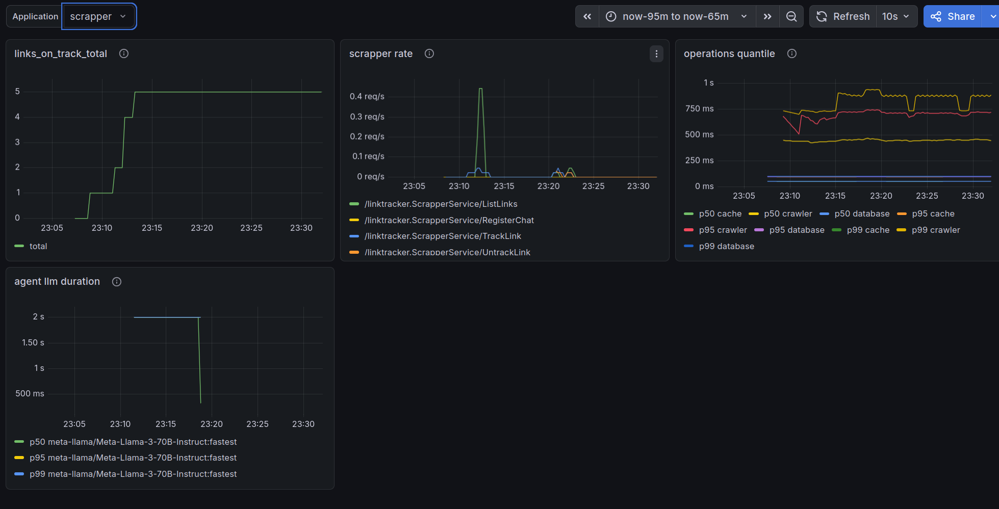
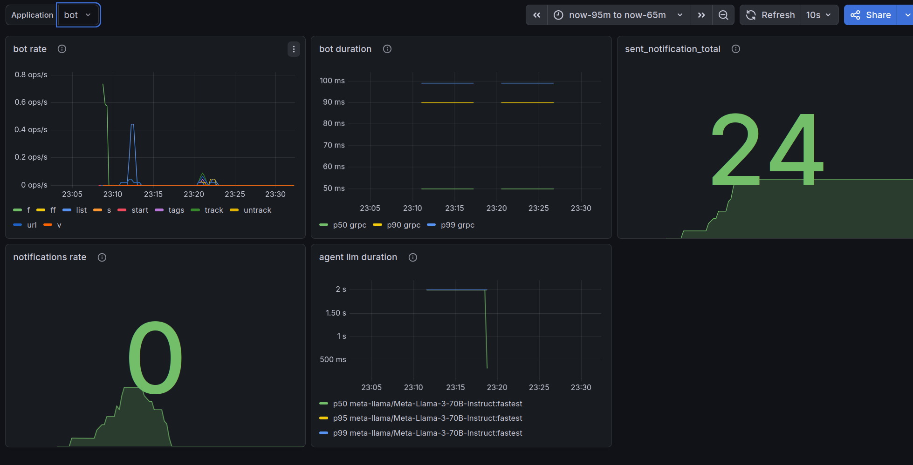
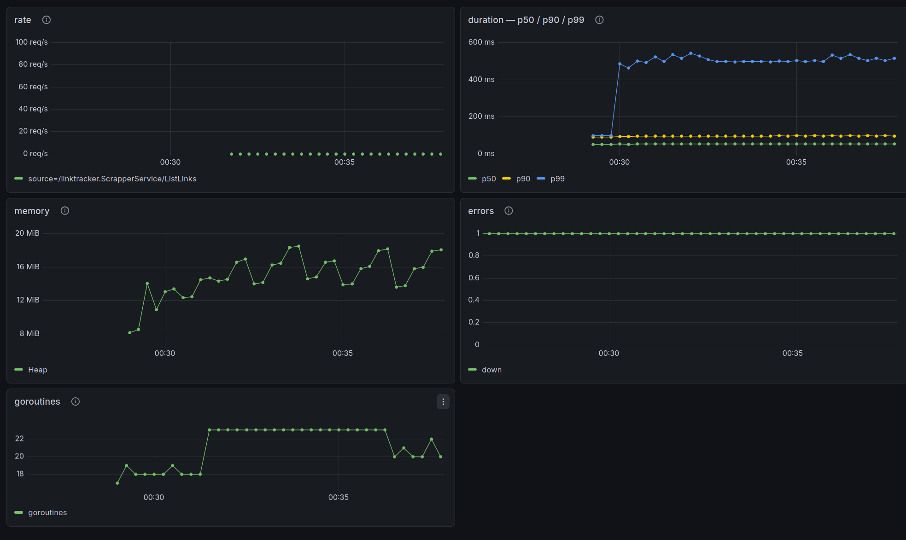

# Observability

## Metrics

All services use a Push model: metrics are collected in a `prometheus.Registry` and pushed to **Pushgateway** every 10 seconds via `GatewayPusher`. Data is visualized in Grafana.

### Scrapper Service

| Metric | Type | Labels | Description |
| --- | --- | --- | --- |
| `links_on_track_total` | Gauge | - | Number of tracked links |
| `request_duration_ms_total` | Histogram | `scope`, `scope_type` | Operation duration (crawl, db queries, cache) |
| `api_requests_total` | Counter | `source` | Number of external API requests (github, stackoverflow) |

### Bot Service

| Metric | Type | Labels | Description |
| --- | --- | --- | --- |
| `command_requests_total` | Counter | `command` | Number of processed commands (/track, /untrack, /list, etc.) |
| `command_duration_ms_total` | Histogram | `scope`, `scope_type` | Command processing duration |
| `sent_notification_total` | Counter | - | Number of delivered notifications |

### Agent Service

| Metric | Type | Labels | Description |
| --- | --- | --- | --- |
| `request_duration_ms_total` | Histogram | `scope`, `scope_type` | Operation duration (filtering, summarization, grouping) |

### Grafana Dashboards

#### RED Dashboard

- **Rate:** `rate(command_requests_total[5m])` by command, `rate(api_requests_total[5m])` by source
- **Duration:** p50/p90/p99 latency via `histogram_quantile` for `command_duration_ms_total` and `request_duration_ms_total`
- **Memory:** `process_resident_memory_bytes`, `process_virtual_memory_bytes`, `go_memstats_heap_inuse_bytes`
- **Errors:** `absent(up{job=~"bot|scrapper|agent"})`
- **Goroutines:** `go_goroutines{job=~"bot|scrapper|agent"}`

#### Business Dashboard

- **Links on track:** `links_on_track_total{job="scrapper"}` — number of links being tracked
- **Command rate (bot):** `rate(command_requests_total[1m])` by command
- **API rate (scrapper):** `rate(api_requests_total[1m])` by source
- **Duration (scrapper):** p50/p95/p99 `request_duration_ms_total` by scope
- **Duration (bot):** p50/p90/p99 `command_duration_ms_total` by scope
- **Duration (agent):** p50/p95/p99 `request_duration_ms_total` by scope_type
- **Notification count:** `sent_notification_total` + `rate(sent_notification_total[5m]) * 60`

#### Examples







### Alerts

- **High Memory Usage:** `process_resident_memory_bytes > 200MB` for 1 minute, configured via Grafana Alerting

---

## Logging

Services use the `log/slog` package for structured logging:

```go
slog.New(slog.NewJSONHandler(os.Stdout, nil))
```

- **Structured:** each log is output as JSON (todo: add Loki or ELK)
- **Attributes:** typed keys (`slog.String`, `slog.Int64`, `slog.Any`, `slog.Duration`, ...) instead of string formatting
- **Module context:** each component has its own context `logger.With(slog.String("module", "..."))`

### Log Examples

```json
{"level":"INFO","msg":"crawl resource start","link":"github.com/owner/repo","module":"crawler-service","time":"______"}
{"level":"INFO","msg":"resource crawled","link":"github.com/owner/repo","module":"crawler-service","time":"______"}

{"level":"INFO","msg":"subscribe start","link":"github.com/owner/repo","client_id":________}
{"level":"INFO","msg":"subscribe end","link":"github.com/owner/repo","client_id":________}

{"level":"INFO","msg":"request","method":"POST","path":"/links","duration":"12ms"}

{"level":"ERROR","msg":"sending request","err":"","module":"summarizer"}

{"level":"INFO","msg":"metrics pushed","module":"push-publisher"}
{"level":"ERROR","msg":"push metrics to gateway","err":"...","module":"push-publisher"}
```
